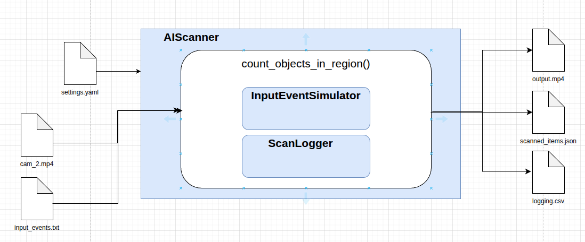
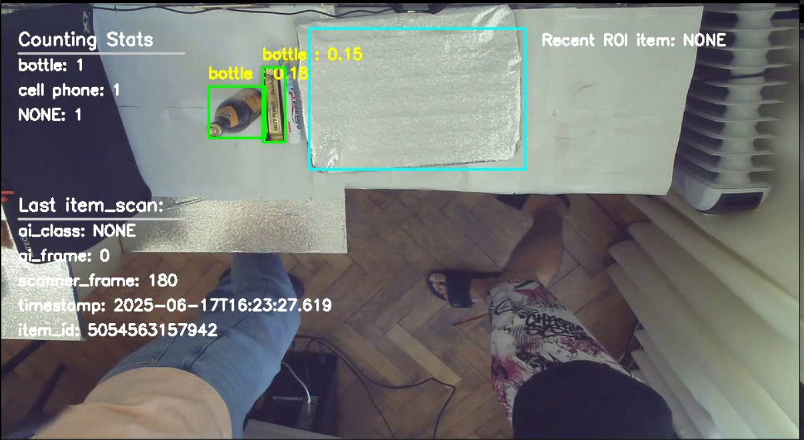
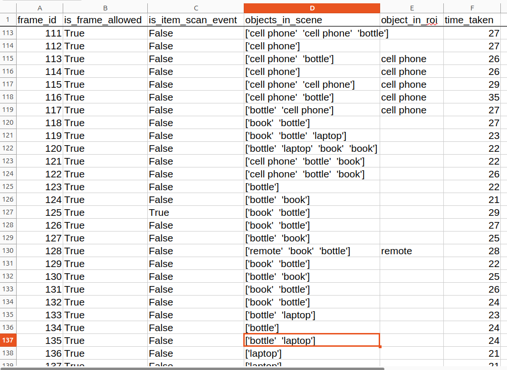
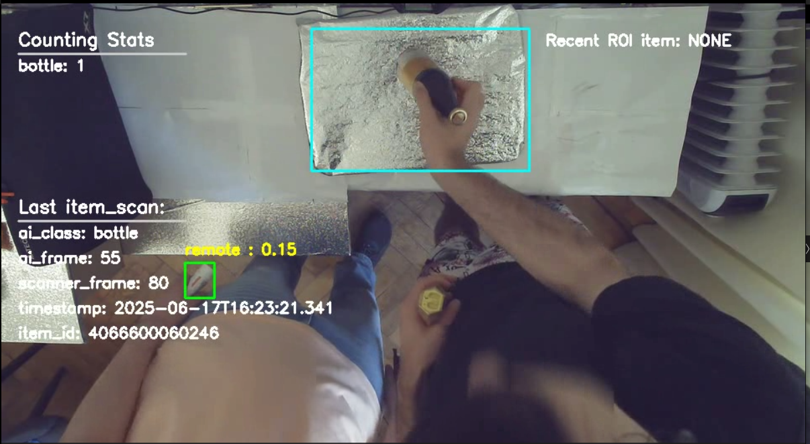

# Self checkout with CV

## Pre-requisites
- Python >= 3.12
- virtualenv
- git
- GPU (for faster inference)

## Installation
```
python3 -m venv .venv
source .venv/bin/activate
pip install -r requirements.txt
```

## Usage
Modify the `settings.yaml` file to suit your needs.
```
(.venv) $ python checkout.py
```

## Overall Design


### Simplified explanation of the pipeline
The complete pipeline in `count_objects_in_region()` function is as follows:
1. Setup the processing parameters from the `settings.yaml` file (or manually set them in the code/unittest).
2. Read the input event file and simulate the `item_scan` event and create a `ScanLogger` object.
3. For each frame in the video, perform the following steps:
    - Decide if the frame is allowed to be processed?
    - Insert the current `frame` into `Yolo11` tracker and get the prediction.
    - Draw the bounding box of the region of interest on the current frame.
    - Detect if any object is in ROI and update the last ROI object (with cool-off time).
    - Get the `item_scan` event from the input event file? (this will be replaced by actual item_scan event from **Scanner**) if yes, then get the statistics from the last `item_scan` event and merge them with `ai_pred`.
    - Visualize the statistics, last `item_scan` event and last ROI object.
    - Log the cycle information and write the frame to the output video.



## Design Choices and Considerations

### Monolothic ⛔ vs Modular design ✅
Althought the whole task could've been easily implemented as a monolothic script, it was decided to split the code into multiple modules to make it more modular and easier to maintain. For instance classes `AIScanner`, `InputEventSimulator` and `ScanLogger` are written as separate classes to make them scalable and reusable.

### Command line arguments ⛔ vs Configuration file ✅
Since there was no restriction on how to implementation of the frame selection mechanism, it was decided to use a configuration file to store the parameters. This means that the `AIScanner` class can be used as-is as `unittest` with ground-truth labels.

### Spot association ⛔ vs Cool-off time ✅
There exists a possibility that the tracking or detection fails at the exact time the `item_scan` event is triggered. Which would result in non-associated items from `AIScanner` object. This problem should be reduced by training a specialized neural network which does not lose track or is better at detection. However for this task, it was decided to use the cool-off time to use recent historic predictions by object detector/tracker.
NOTE: The cool-off time is set to ~1 seconds (which is assumed to be the normal time a human would move objects) but can be changed in the `settings.yaml` file.

## Model Architecture selection
Since the prediction of model architecture is not part of the task, it was decided to use a pre-trained **Yolo11s** model from the [Ultralytics](https://github.com/ultralytics/ultralytics) repository. The system was benchmarked to run roughly ~40 FPS on RTX-3070 GPU. However since the model can be selected from `settings.yaml` file, it can be easily changed to other models (such as `Yolo12` or `Yolo11<m,l,x>`) as well.



## Metrics / statistics selection
It is assumed that once the model is trained with actual data, the classes predicted by the model will correspond to the classes coming from the **Scanner's** item_scan event. Furthermore, the AI system will be able to track better. This will result in better detection and low latency time between the **ai_frame** and **scanner_frame** (as shown in following screenshot).



## System logs
A timeseries logger class (namely `ScanLogger`) is created to log the system's performance. The class can be extended to include more metrics and statistics as needed.